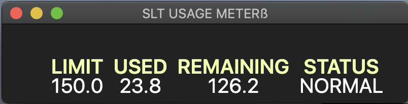

# SLT Usage Meter

Standalone desktop application to check SLT data usage with realtime refresh. 



## Getting Started

This standalone application uses data fetching from a python backend.

### Prerequisites

```
node
npm
electron
```

### Installing

To get started, download the repo then run npm install:


```
npm install
```

## Authors

* **Dulaj Kavinda** - *Initial work* - [dulajkavinda](https://github.com/dulajkavinda)
